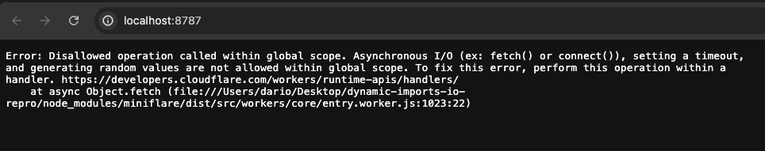
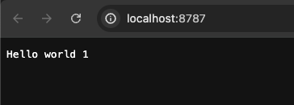

# Workerd dynamic imports I/O repro

This repository reproduces the issue of I/O operations being disallowed on the top level of dynamically imported modules ([`src/modules.js`](./src/module.js)).

## Reproduction steps

Install the dependencies:
```sh
npm i
```

Run `wrangler dev` without bundling to see the issue:
```sh
npm run dev:no
```



Run `wrangler dev` with bundling to see the "expected" behavior:
```sh
npm run dev
```



